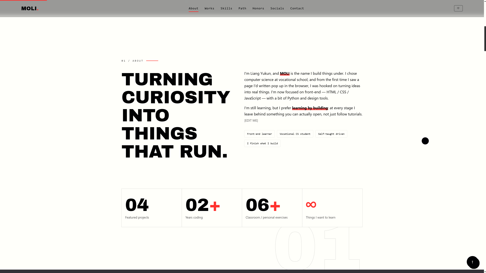
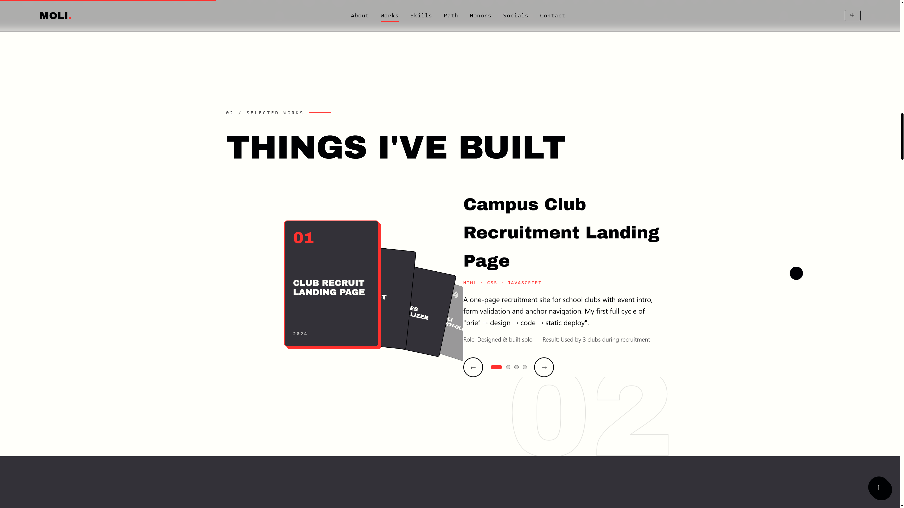
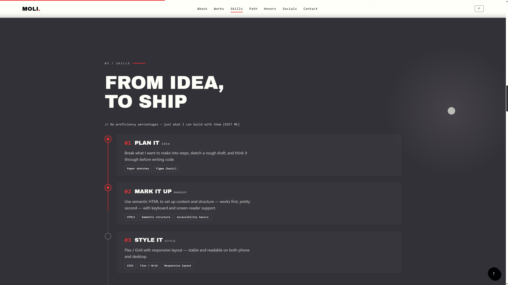
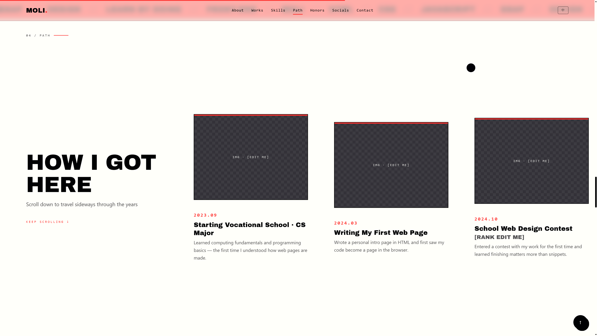
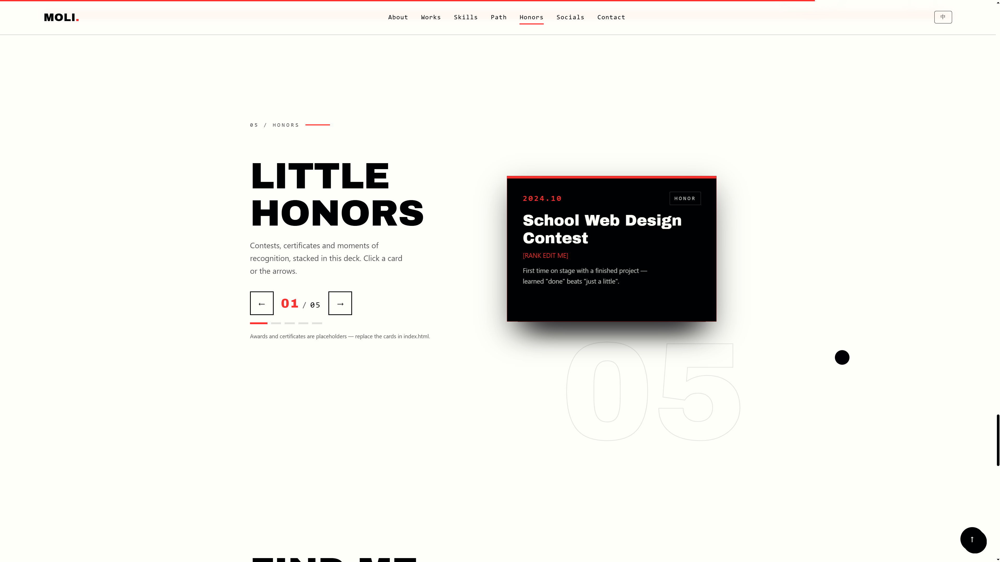
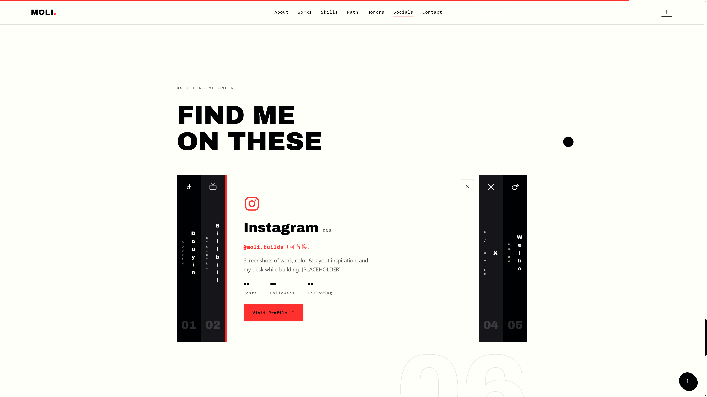
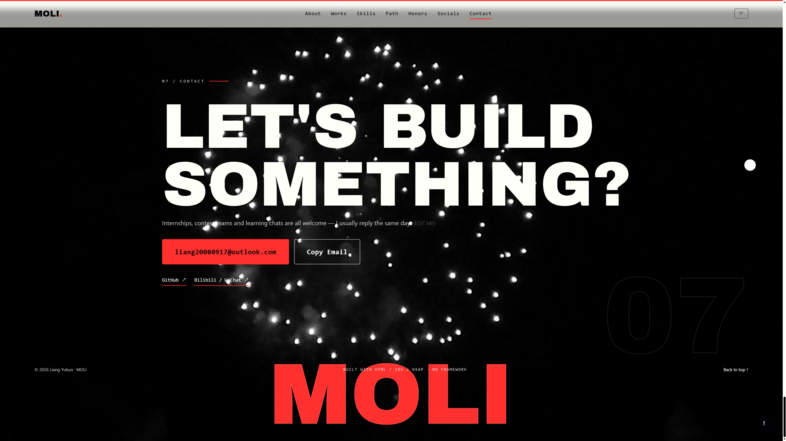

<div align="center">

# MOLI · Personal Portfolio

**一个纯静态、零构建、双击即开的个人作品集网站。**
黑白红编辑海报风 × GSAP 电影级动效 × 中英双语切换。

[](https://developer.mozilla.org/docs/Web/HTML)
[](https://developer.mozilla.org/docs/Web/CSS)
[](https://developer.mozilla.org/docs/Web/JavaScript)
[](https://gsap.com)
[](./LICENSE)
[](#-quick-start)

### 🔗 Live Demo
# [moli080917.github.io/mywebsite](https://moli080917.github.io/mywebsite/)

</div>

---

## ✦ 关于这个项目

这是我为自己打造的个人主页，也是一次「不用任何框架、只靠 HTML / CSS / JavaScript 能做到什么程度」的实验。

没有打包工具、没有 node_modules、没有构建步骤 —— **下载后双击 `index.html` 就能完整运行**。动效层以 [GSAP 3.15](https://gsap.com) 渐进增强，并内置完整的原生回退：CDN 加载失败、断网或开启「减少动态效果」时，网站照常完整可读，只是动效换回轻量版本。

> 作者：**Liang Yukun** / 品牌名 **MOLI** —— 中职计算机专业 · 前端方向
> 设计语言：近白纸感底色 + 深炭反色分区 + 正红焦点色，全站严格黑白红三色。

---

## ✦ 效果预览


<div align="center">
  
  
  
  
  
  
  
</div>

---

## ✦ 功能特性

### 🌐 中英双语切换
- 页头一枚 mono 描边胶囊钮（中文态 `EN` / 英文态 `中`），移动端在全屏菜单内提供整宽切换钮
- 全站文案、按钮、ARIA 标签、`<title>` 与 meta 描述一键整体切换，品牌名与技术标签保持不翻译
- 首次访问按浏览器语言自动选择，之后用 `localStorage` 记住选择
- 词典与引擎独立于 `js/i18n.js`，结构清晰，方便移植到自己的项目

### 🎬 GSAP 电影级动效
- **ScrollSmoother** 桌面端平滑滚动（触屏自动回退原生滚动，保证跟手）
- **SplitText** 大标题逐字 3D 翻转、遮罩上推；**ScrambleText** 身份行「解码」入场
- **ScrollTrigger** 视口触发：区块进入画面时才开始演出
- 开场品牌幕布、导航红色滑动指示器、红色幕布转场、按钮磁吸、点击涟漪

### 🎆 视频背景（页头 / 页尾）
- Hero 与页尾联系区均为本地视频背景，统一 `grayscale` 灰度化处理，绝不破坏黑白红色板
- Ken Burns 慢推 + 滚动视差，离屏自动暂停省电，移动端 `playsinline` 内联播放

### 🛤 横向滚动时间线「一路怎么走来」
- 桌面端整段 pin 钉住，向下滚动驱动卡片横向位移
- 一条圆润粗红路线（Catmull-Rom 转贝塞尔）沿图片底部大幅蜿蜒，用 DrawSVG 随滚动逐段描红 —— 没有灰色底稿，只保留运动过程
- 移动端自动切换为干净的原生横向滑动（scroll-snap），不绘制 SVG

### 🏆 3D 荣誉牌堆
- 一摞带纵深感的荣誉卡：点卡片 / 左右箭头切换，圆点跳页，`01 / 05` 计数
- 前进时新卡自上方落入，后退时旧前卡下坠归位；减少动态时纵向平铺

### 🔗 链式社交手风琴
- 抖音 / 哔哩哔哩 / Instagram / X / 微博 五根深色窄列，点击一根顺滑展开为浅色面板（账号、简介、数据、跳转按钮），单开模式，带完整 ARIA 与键盘操作

### ✨ 更多细节
- **反色跟随光标**：白色正圆以 `mix-blend-mode: difference` 叠加（不替换系统光标），悬停可交互元素时放大
- **图片灯箱**：点击任意配图全屏放大查看，支持 Esc / 遮罩关闭
- **交互微粒场**：改编自 [CodePen《Shape Wave》](https://codepen.io/donotfold/pen/yyapzOP)，鼠标靠近时微粒平滑绽放，点击扩散环形波
- 深色区鼠标聚光灯、技术词无限 Marquee、页脚巨型 MOLI 描边随滚动被红色填满、红色选区与细滚动条

### 📱 工程与体验
- **零构建**：纯 HTML + CSS + JS，双击即开
- **全响应式**：手机 / 平板 / 桌面自适应，移动端无横向溢出
- **无障碍**：语义化标签、跳转链接、键盘焦点样式、完整 ARIA、WCAG AA 对比度
- **三层降级**：禁用 JS 内容完整可读 → CDN 失败回退原生动效 → 「减少动态效果」直接呈现终态

---

## ✦ 技术栈

| 类别 | 选型 |
|---|---|
| 结构 | 语义化 HTML5 |
| 样式 | 原生 CSS3（自定义属性 / Grid / Flex / 响应式） |
| 脚本 | 原生 JavaScript（ES6+，无任何框架） |
| 动效 | GSAP 3.15：ScrollTrigger · ScrollSmoother · ScrollToPlugin · SplitText · ScrambleText · DrawSVG |
| 字体 | Archivo Black / JetBrains Mono（系统字体兜底） |
| 媒体 | 本地 MP4 背景视频（灰度化）+ 首帧 poster |

---

## ✦ 目录结构

```
mywebsite/
├─ index.html          # 唯一页面（所有区块内容都在这里）
├─ css/
│  ├─ variables.css    # 设计变量：配色 / 字体 / 间距（换风格改这里）
│  └─ style.css        # 全部样式、响应式与动效
├─ js/
│  ├─ main.js          # 全部交互：GSAP 动效层 + 原生回退
│  ├─ i18n.js          # 中英双语词典与切换引擎
│  └─ gsap/            # GSAP 核心与插件（本地兜底，也可改用 CDN）
├─ video/              # 页头 / 页尾背景视频与首帧 poster
└─ docs/               # 设计过程文档（可保留可删）
```

---

## ✦ Quick Start

### 方式一：双击运行（最简单）

下载或克隆本仓库，直接双击 `index.html`，用任意现代浏览器（Edge / Chrome / Firefox / Safari）打开即可。无需 Node、无需启动服务。

### 方式二：本地服务器（与线上表现完全一致）

```bash
# 已装 Python
python -m http.server 8000

# 或已装 Node
npx serve .
```

然后浏览器访问 `http://localhost:8000`。

### 方式三：克隆

```bash
git clone https://github.com/MOLI080917/mywebsite.git
cd mywebsite
# 双击 index.html，或按方式二启动本地服务
```

---

## ✦ 改成你自己的主页

1. **换内容**：编辑 `index.html`，按区块替换文案、作品、经历、社交链接与联系方式
2. **换语言文本**：编辑 `js/i18n.js` 中的 `zh` / `en` 词典；新增文案时在 HTML 上加 `data-i18n="键名"` 并补上两套译文
3. **换配色 / 字体**：修改 `css/variables.css` 中的设计变量，全站即时生效
4. **换背景视频**：把 mp4 放进 `video/`，改 `index.html` 里的 `<source>` 与 `poster` 路径

> 建议背景视频压到 720p、单段 1.5–3MB 并去掉音轨；用 [HandBrake](https://handbrake.fr) 或 ffmpeg 即可。

---

## ✦ 免费部署到 GitHub Pages

1. Fork 本仓库，或在自己的账号下新建仓库并上传全部文件
2. 仓库 **Settings → Pages → Build and deployment → Source 选择 `main` 分支、根目录 `/(root)`**，保存
3. 约一分钟后访问 `https://<你的用户名>.github.io/<仓库名>/`

也可以直接部署到 Vercel / Netlify：本项目没有构建步骤，静态托管即可。

---

## ✦ 灵感与致谢

- [GSAP](https://gsap.com) —— 没有它就没有这些动效
- [CodePen: Shape Wave](https://codepen.io/donotfold/pen/yyapzOP) —— 宣言微粒场的灵感来源
- 以及 CodePen / GitHub 上无数无私分享前端创意的作者们 🙏

---

## ✦ License

本项目基于 [MIT License](./LICENSE) 开源，欢迎学习、参考与改造。保留原作者署名即可，商用或转载请先联系。

---

## ✦ 联系我

- 📧 Email：[liang20080917@outlook.com](mailto:liang20080917@outlook.com)
- 🐙 GitHub：[MOLI080917](https://github.com/MOLI080917)
- 🌐 在线主页：[moli080917.github.io/mywebsite](https://moli080917.github.io/mywebsite/)

<div align="center">

**如果这个项目对你有启发，欢迎 Star ⭐ 支持。**

`MOLI. — I turn ideas into things you can click open with code.`

</div>
